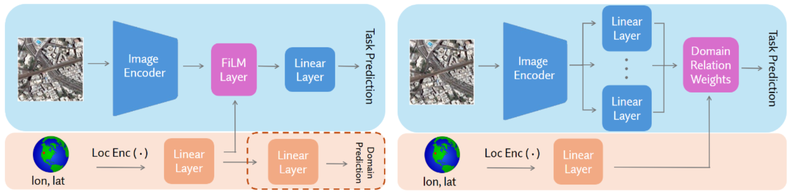

# Robustness to Geographic Distribution Shift using Location Encoders

Complete experiment code for the paper: [Robustness to Geographic Distribution Shift Using Location Encoders](https://arxiv.org/pdf/2503.02036). 




## Installation

1) Install Python dependencies using: `pip install -r requirements.txt`. Make sure to uncomment the first line of the `requirements.txt` file if you are installing for GPU machines.

2) Download FMoW v1.1 ("fmow") or PovertyMap v1.1 ("poverty") dataset using `python get_wilds_dataset.py --dataset <dataset> --compress`.

3) Download the SatCLIP encoder weights from HuggingFace (if using SatCLIP): https://huggingface.co/models?other=arxiv:2311.17179


## Configs
Training options and hyperparameters are all specified in yaml config files located under `configs`. They are passed into the training script using the `--config` command-line arg.

Each dataset has a base config under `configs/base`, which corresponds to the baseline standard ERM configuration for that dataset. You will always need to specify exactly 1 base config.

Other (location-aware or location-free) domain adaptation methods can then be chained on to the base config. The ordering does not matter. For example:

- To run training on PovertyMap using DCP and GeoCLIP location encoder features, use `--config fmow,geoclip,film`
- To run training on FMoW using the IRM penalty and SatCLIP groups, use `--config fmow,irm,satclip`. To run training on FMoW using IRM with the default groups (e.g. continent splits for FMoW), use `--config fmow,irm`. 
- To run standard ERM with WRAP features concatenated to image features, use `--config fmow,wraplinear`

## Training and Inference

To kick off training or inference, run:

`python train.py --data-dir <data_dir> --config <configs> [ --loc-encoder-weights <weights> --checkpoint <ckpt> ]`

- To run inference, use the `--checkpoint` to pass in a path to the Lightning module checkpoint.
- `--loc-encoder-weights` should be the path to the SatCLIP location encoder weights. It is required for loading SatCLIP.
- `--config` should be specified as described in the previous section.


## Citation

```
@article{wildsgeoshift2025,
      title={Robustness to Geographic Distribution Shift Using Location Encoders}, 
      author={Ruth Crasto},
      year={2025},
      eprint={2503.02036},
      archivePrefix={arXiv},
      primaryClass={cs.LG},
      url={https://arxiv.org/abs/2503.02036}, 
}
```